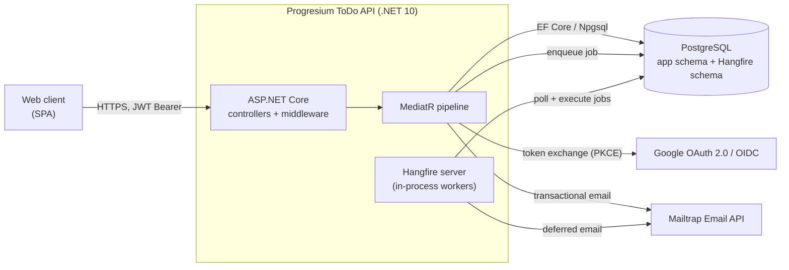
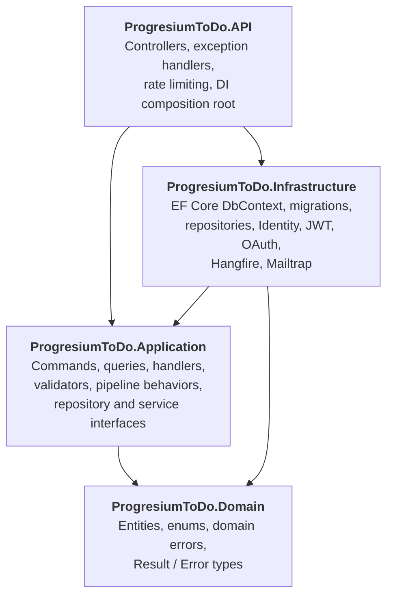
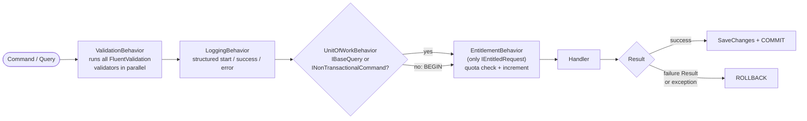
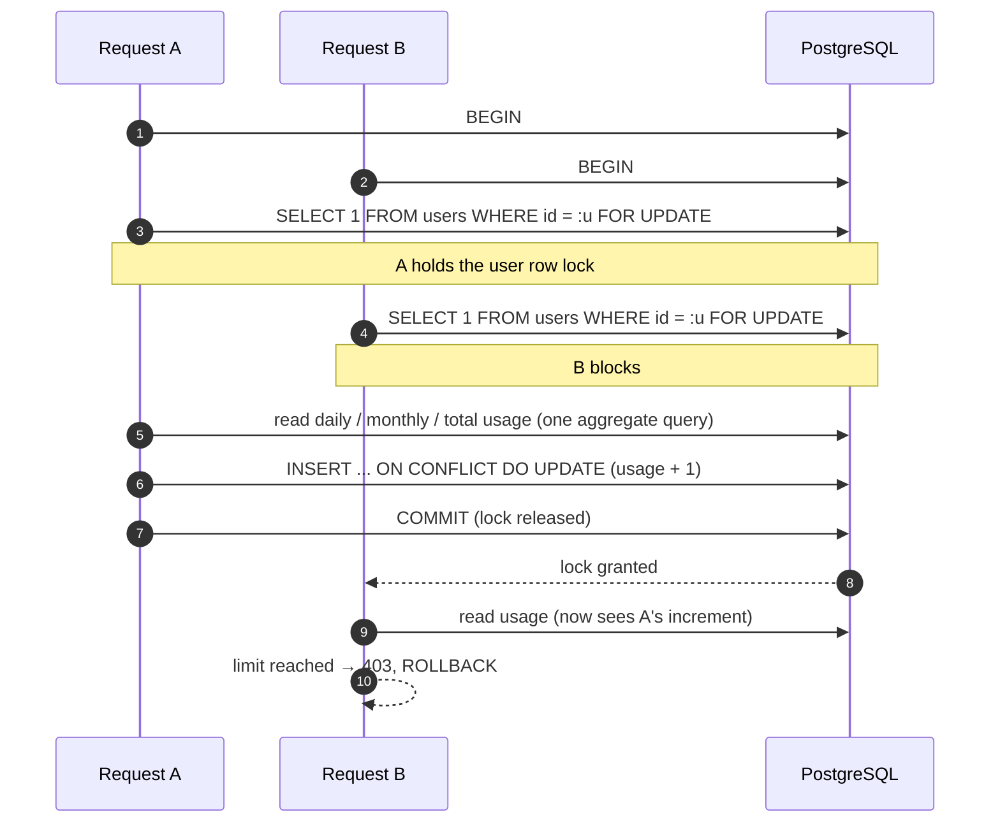
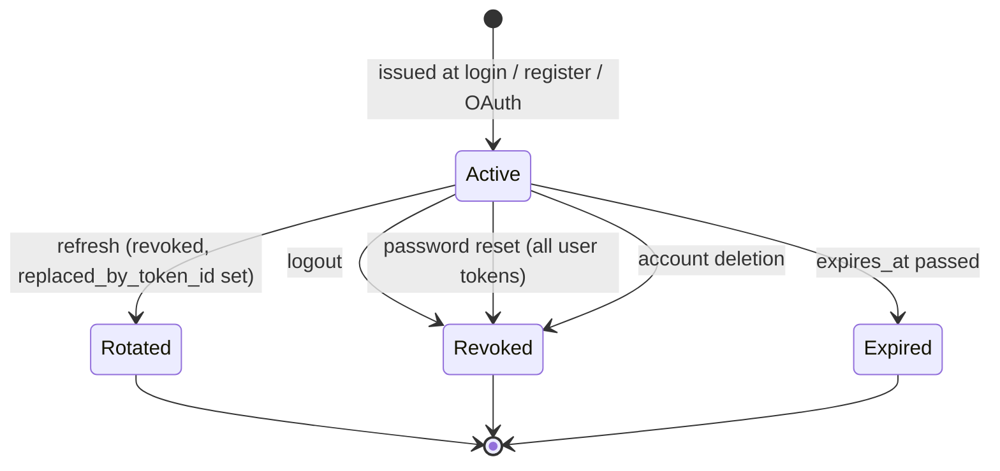
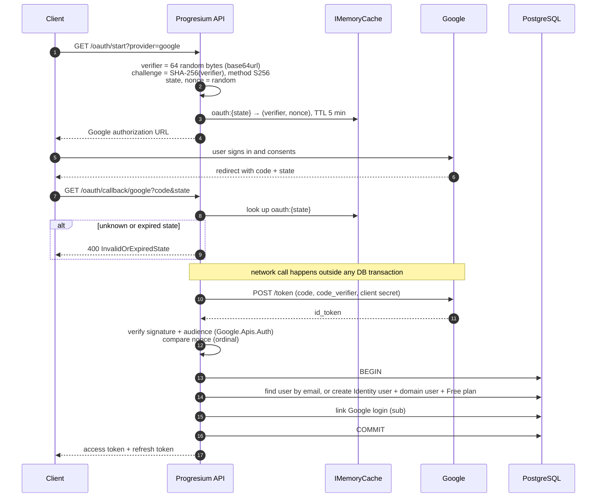
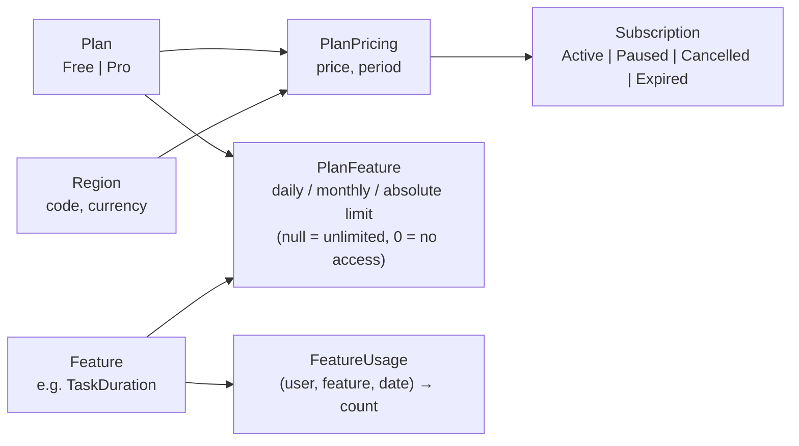
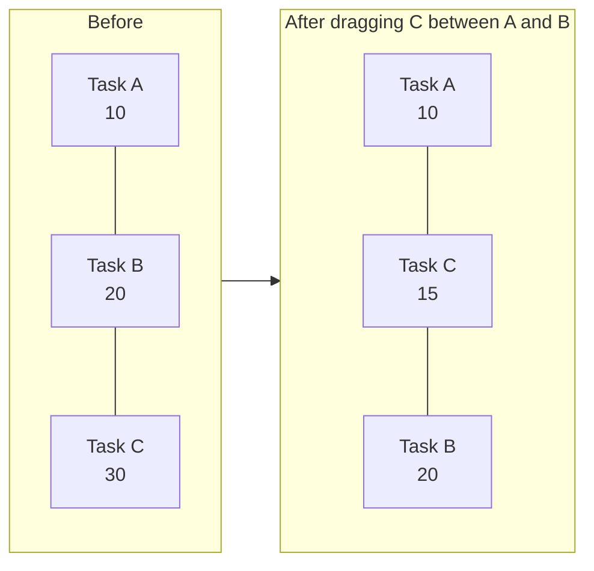
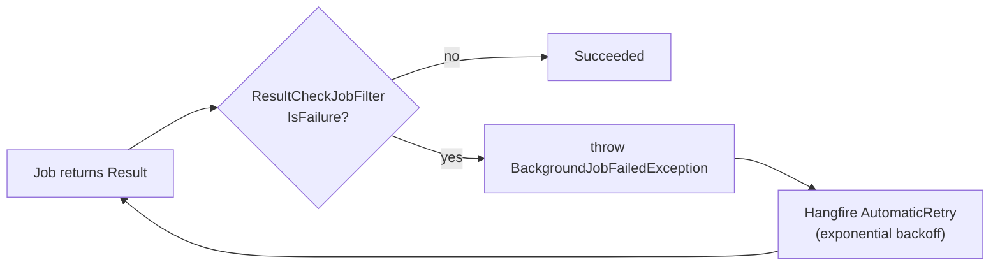
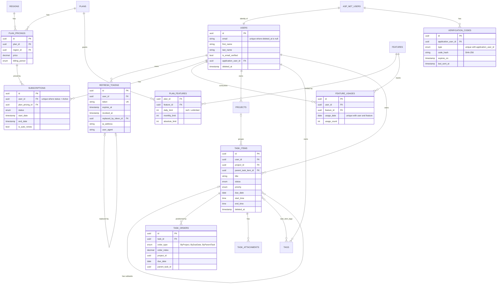

# Progresium ToDo API

[](https://dotnet.microsoft.com/)
[](https://learn.microsoft.com/en-us/dotnet/csharp/)
[](https://www.postgresql.org/)
[](https://www.docker.com/)

Backend API for **Progresium**, a focus-first task and project management SaaS. It is a modular monolith on .NET 10 and PostgreSQL, built with Clean Architecture and CQRS (MediatR). Most of the engineering effort went into **correctness under concurrency**, **explicit transaction boundaries**, and **secure authentication**, rather than CRUD surface area.

> **Status:** development paused before public launch. The codebase is complete through auth, billing, entitlements, tasks, projects and tags, and is kept public as a reference implementation.

| | |
|---|---|
| Hand-written C# (excl. migrations) | ~9,700 lines |
| Projects | 4 (Domain, Application, Infrastructure, API) |
| HTTP endpoints | 37 across 10 controllers |
| FluentValidation validators | 28 |
| EF Core migrations | 41 |
| History | 158 commits, 15 feature-branch pull requests |

---

## Table of Contents

1. [System Context](#1-system-context)
2. [Solution Architecture](#2-solution-architecture)
3. [Request Lifecycle](#3-request-lifecycle)
4. [Transaction Management](#4-transaction-management)
5. [Concurrency Control](#5-concurrency-control)
6. [Authentication and Security](#6-authentication-and-security)
7. [Billing and Entitlements](#7-billing-and-entitlements)
8. [Task Ordering](#8-task-ordering)
9. [Persistence Layer](#9-persistence-layer)
10. [Background Jobs](#10-background-jobs)
11. [Error Handling](#11-error-handling)
12. [Data Model](#12-data-model)
13. [API Reference](#13-api-reference)
14. [Getting Started](#14-getting-started)
15. [Known Limitations and Roadmap](#15-known-limitations-and-roadmap)

---

## 1. System Context



A single deployable service. PostgreSQL is used both as the system of record and as Hangfire's job store, so background jobs survive restarts without an extra broker.

---

## 2. Solution Architecture



Dependencies point inward. The Domain project has **no package references at all**, and the Application layer depends only on abstractions (`IUnitOfWork`, `IEmailService`, `IBackgroundJobService`, repository interfaces) that Infrastructure implements.

Within the Application layer every feature is a **vertical slice**:

```
Application/
├── Auth/        Commands/{RegisterUser, LogInUser, LogOutUser, RefreshTokens, VerifyEmail,
│                          SendVerificationEmail, SendForgotPasswordEmail, ResetPassword}
├── OAuth/       Commands/{StartOAuth, GoogleCallbackOAuth}
├── Billing/     Commands/{SubscribeToPlan, CancelSubscription}   Queries/...
├── Tasks/       Commands/{CreateTask, UpdateTask, DeleteTask, CreateSubtask, UpdateSubtask}
├── Projects/    Tags/    Users/    Waitlist/    Support/
└── Abstractions/
    ├── Behaviors/   ValidationBehavior, LoggingBehavior, UnitOfWorkBehavior, EntitlementBehavior
    └── Messaging/   ICommand, IQuery, INonTransactionalCommand, handler interfaces
```

**Identity is isolated from the domain.** ASP.NET Core Identity's `ApplicationUser` (password hashes, external logins) lives in Infrastructure. The domain `User` is a separate entity that references it by `ApplicationUserId`, so business logic never touches Identity types.

Shared build settings live in `Directory.Build.props` (net10.0, nullable reference types enabled), and all package versions are pinned centrally in `Directory.Packages.props`.

---

## 3. Request Lifecycle

### HTTP middleware

```
UseHttpsRedirection → UseRouting → UseCors → UseExceptionHandler
  → UseAuthentication → UseAuthorization → UseRateLimiter → Controller
```

Controllers are thin. Each action builds a command or query, sends it through MediatR, and maps the `Result` to an HTTP response through `ApiControllerBase.FromResult`.

### MediatR pipeline

Behaviors are registered in this order, so every request flows through them outside-in:



The ordering is deliberate. Validation runs before a transaction is opened, so malformed requests never touch the database. The entitlement check runs **inside** the transaction, which is what makes its row lock meaningful (see [Concurrency Control](#5-concurrency-control)).

---

## 4. Transaction Management

`UnitOfWorkBehavior` gives every command exactly one database transaction, without handlers having to manage it:

- **Queries** (`IBaseQuery`) skip the transaction entirely and use `AsNoTracking()` reads.
- **Commands** are wrapped in `BEGIN ... COMMIT`.
- A handler that returns `Result.Failure` triggers a **rollback**, not a commit. Business-rule failures and exceptions are both treated as "nothing happened", so partially applied work is never persisted.

### Why some commands opt out: `INonTransactionalCommand`

Commands that call a third party over the network are marked `INonTransactionalCommand`:

| Command | External call |
|---|---|
| `GoogleCallbackOAuthCommand` | Google token endpoint |
| `SendVerificationEmailCommand` | Mailtrap |
| `SendForgotPasswordEmailCommand` | Mailtrap |
| `JoinWaitlistCommand` | Hangfire enqueue (Mailtrap later) |
| `ContactUsCommand` | Hangfire enqueue (Mailtrap later) |

Holding an open transaction (and any row locks it took) across an HTTP call to an external provider couples database contention to that provider's latency, and a sent email cannot be rolled back anyway. These handlers instead perform the network call first and then open a **short, explicit transaction** only around the database writes. For example, the Google callback exchanges the authorization code and validates the ID token, then begins a transaction to find or create the user, link the Google login, and create the Free subscription atomically.

### Atomic onboarding

Registration is a normal transactional command. Creating the Identity account, the domain `User`, and the initial Free-plan `Subscription` all happen in one transaction, so a user can never exist without a plan.

---

## 5. Concurrency Control

PostgreSQL runs at its default `READ COMMITTED` isolation level, so every read-then-write path that could race is protected explicitly. Four techniques are used, each chosen for the shape of the race.

### 5.1 Pessimistic row lock for quota enforcement

Plan features have daily, monthly and lifetime quotas. A naive "read usage, compare to limit, increment" lets two parallel requests both read `usage = limit - 1` and both pass. `EntitlementService` serializes these checks per user:



`AcquireUserLockAsync` **throws if no transaction is active**, because `FOR UPDATE` outside a transaction releases the lock immediately and silently provides no protection. Misuse fails loudly instead of quietly.

All three usage windows are computed in a **single aggregate query** (`GROUP BY` with filtered `SUM`s), so the check costs one round trip.

### 5.2 Atomic upsert for counters

Usage rows are keyed by a unique `(user_id, feature_id, usage_date)` index and incremented with `INSERT ... ON CONFLICT DO UPDATE`, so the first request of the day cannot collide with a concurrent one on insert.

### 5.3 Unique constraint as arbiter

Each user has at most one live verification code per type, enforced by a unique index on `(application_user_id, type)`. Two concurrent "resend code" requests may both try to insert. The loser catches the `DbUpdateException`, detaches its entity, reloads the winner's row and updates it. These commands are non-transactional, which matters here: in PostgreSQL a failed statement aborts the enclosing transaction, so the recovery query would otherwise fail.

### 5.4 Partial unique indexes as invariants

Business invariants are enforced in the schema, not only in code:

| Index | Invariant |
|---|---|
| `subscriptions(user_id) WHERE status = 'Active'` | a user has at most one active subscription |
| `users(email) WHERE deleted_at IS NULL` | emails are unique among live accounts; a deleted account frees its email |
| `projects(user_id, name) WHERE deleted_at IS NULL` | no duplicate project names per user |
| `tags(user_id, name) WHERE deleted_at IS NULL` | no duplicate tag names per user |
| `refresh_tokens(token)` | token lookup is unique and indexed |

---

## 6. Authentication and Security

### 6.1 Tokens

- **Access token:** HS256 JWT validated for issuer, audience, lifetime and signature. Claims: `sub`, `email`, and a custom `email_verified` claim.
- **Refresh token:** 64 bytes from a CSPRNG (`RandomNumberGenerator`), Base64-encoded, stored with expiry, device, IP and user-agent fields.

Refresh tokens **rotate** on every use. The old token is revoked and records which token replaced it, forming an auditable chain:



### 6.2 Email verification as an authorization policy

Most endpoints use `[AuthorizeVerified]`, which maps to a policy requiring `email_verified = True` in the JWT. A custom `IAuthorizationMiddlewareResultHandler` turns that specific failure into a descriptive `403 Email Verification Required` problem response, rather than a bare 403, so the client knows exactly what to prompt for.

Verification and password-reset codes are 6-digit numbers from a CSPRNG, **stored only as SHA-256 hashes**, expire after 15 minutes, and have a 60-second resend cooldown per user.

### 6.3 Google sign-in: Authorization Code flow with PKCE



- **PKCE** prevents a stolen authorization code from being redeemed by anyone without the verifier.
- **state** binds the callback to a flow this server started (CSRF protection).
- **nonce** binds the ID token to that same flow (replay protection).
- Missing `given_name` / `family_name` claims from Google are handled explicitly.

### 6.4 Other measures

- **Rate limiting:** fixed-window, partitioned per client IP, on `POST /auth/reset-password` (10 per 5 min) and `POST /contact-us` (5 per 5 min). Rejections return `429` with a `Retry-After` header and a problem body.
- **Password policy:** minimum 8 characters with upper case, lower case and a digit (ASP.NET Core Identity).
- **Secrets** (connection string, JWT secret, OAuth client secret, Mailtrap key) come from environment variables only. The app fails fast at startup if any is missing.
- **Hangfire dashboard** is mounted only in Development and behind an authorization filter.

---

## 7. Billing and Entitlements



- **Regional pricing:** a plan has one price per `(region, billing period)` pair, each in the region's currency.
- **Plan changes** end the current subscription and start a new one. Cancelling a paid plan moves the user back to Free, so there is always exactly one active subscription (enforced by the partial unique index above).
- **Declarative entitlements:** a request opts into metering by implementing `IEntitledRequest.GetRequiredEntitlements()`. For example, `CreateTaskCommand` and `UpdateTaskCommand` require the `TaskDuration` feature only when a start or end time is set. `EntitlementBehavior` enforces it and returns `403 Entitlement Check Failed` with the specific limit that was hit.
- **Billing-cycle anchoring:** monthly quotas reset on the subscription's anniversary day, not on the 1st of the month. The anchor is clamped to the month length, so a subscription started on the 31st renews on the 28th, 29th or 30th in shorter months.

---

## 8. Task Ordering

Tasks are drag-and-drop sortable in **three independent views**: within a project, within a due date, and among a parent task's subtasks. Each view has its own `task_orders` row per task (`OrderType = ByProject | ByDueDate | ByParentTask`), so reordering in one view never disturbs another.

Positions use **fractional indexing** on a `decimal` column:



| Drop position | New index |
|---|---|
| between `prev` and `next` | `(prev + next) / 2` |
| at the top (only `next`) | `next - 10` |
| at the bottom (only `prev`) | `prev + 10` |
| new task in a view | `max(index) + 10` |

A move is a **single-row update**, not a renumbering of every task below it.

Status changes interact with ordering through `TaskStatusPolicy`, which groups statuses into *In progress* (`Pending`, `InProgress`) and *Finished* (`Completed`, `Cancelled`). Moving a task into *Finished* deletes its order rows. Reopening it recreates them at the end of each relevant view. Changing a task's project or due date moves it to the end of the new view.

When tasks are loaded, subtasks' order rows are fetched for all parent IDs in **one query** and joined in memory, avoiding an N+1 pattern.

---

## 9. Persistence Layer

- **EF Core 10 + Npgsql** with `UseSnakeCaseNamingConvention()`, so the schema reads naturally in SQL (`task_items.due_date`).
- **UUIDv7 primary keys** (`Guid.CreateVersion7()`). They are generated client-side without a round trip and are time-ordered, which keeps B-tree index inserts mostly append-only, unlike random UUIDv4.
- **Soft delete via a `SaveChangesInterceptor`.** `AuditableEntityInterceptor` converts `Deleted` entries of `BaseEntity` into updates that set `deleted_at`, then walks cascade-delete navigations so children are soft-deleted too. Non-soft-deletable dependents are hard-deleted and left to EF Core's own cascade. The same interceptor stamps `updated_at` on every modification.
- **Global query filters** (`deleted_at IS NULL`) on soft-deletable entities, so deleted rows never leak into reads.
- **Read paths** opt into `AsNoTracking()` through a `trackChanges` flag on every repository method.
- **Server-side filtering, sorting and pagination** for task lists (by project, due-date range, priority, created date, or a custom view order).

---

## 10. Background Jobs

Hangfire runs in-process with PostgreSQL storage and `Environment.ProcessorCount` workers. Application code depends only on `IBackgroundJobService`, so Hangfire is an Infrastructure detail.

Waitlist welcome emails and contact-form emails are enqueued as fire-and-forget jobs after the data is committed, so the HTTP response does not wait for Mailtrap and a slow or failing provider is retried instead of failing the request.

### Making `Result.Failure` visible to Hangfire

The codebase uses `Result` objects rather than exceptions for expected failures. Hangfire only retries jobs that **throw**, so a failed email send that returned `Result.Failure` was recorded as *Succeeded* and never retried. `ResultCheckJobFilter` is a global `IServerFilter` that inspects each job's return value and throws `BackgroundJobFailedException` on failure, so Hangfire's automatic retries with backoff apply.



---

## 11. Error Handling

Expected failures are **values**, unexpected ones are **exceptions**:

- `Result` / `Result<T>` with a list of `Error(Code, Message)`. The constructor rejects invalid states (success with errors, failure without errors), and reading `.Value` of a failed result throws.
- Each domain area has an errors catalogue (`UserErrors`, `SubscriptionErrors`, `FeatureUsageErrors`, ...), giving clients stable error codes.

Every error response is RFC 7807 `application/problem+json`:

| Source | Status | Title |
|---|---|---|
| `Result.Failure` from a handler | 400 | One or more business rules were violated (`errors`, `traceId`, `requestId`) |
| `ValidationException` (FluentValidation) | 400 | Validation failed |
| Missing `email_verified` claim | 403 | Email Verification Required |
| `EntitlementException` | 403 | Entitlement Check Failed |
| Rate limiter rejection | 429 | with `Retry-After` |
| Any other exception | 500 | handled by `GlobalExceptionHandler` |

Logging is structured throughout (named placeholders such as `{UserId}`, `{FeatureName}`, `{DurationMs}`), including timing of outbound calls to Google.

---

## 12. Data Model



`PLANS`, `REGIONS`, `FEATURES`, `PROJECTS`, `TAGS`, `TASK_ATTACHMENTS` and `WAITLIST_ENTRIES` are omitted from the attribute listing for brevity.

---

## 13. API Reference

Base path: `/api/progresium-todo/v1`. Interactive documentation is served by **Scalar** at `/scalar/v1`, and the OpenAPI document at `/openapi/v1.json`.

Auth column: **Anon** = anonymous, **JWT** = any authenticated user, **Verified** = authenticated with a verified email.

| Area | Method and route | Auth | Notes |
|---|---|---|---|
| Auth | `POST /auth/register` | Anon | creates user + Free subscription atomically |
| | `POST /auth/login` | Anon | |
| | `POST /auth/refresh-tokens` | Anon | rotates the refresh token |
| | `POST /auth/logout` | JWT | revokes the given refresh token |
| | `POST /auth/send-verification-email` | JWT | 60 s cooldown |
| | `POST /auth/verify-email` | JWT | |
| | `POST /auth/forgot-password` | Anon | |
| | `POST /auth/reset-password` | Anon | rate-limited; revokes all refresh tokens |
| OAuth | `GET /oauth/start?provider=google` | Anon | returns authorization URL |
| | `GET /oauth/callback/google` | Anon | PKCE code exchange |
| Users | `GET /users/me`, `PATCH /users/me` | JWT | profile and current entitlements |
| | `DELETE /users/delete-account` | JWT | soft delete + token revocation |
| Plans | `GET /plans`, `GET /plans/{id}` | Anon | |
| Subscription | `POST /subscription/subscribe`, `POST /subscription/cancel`, `GET /subscription/history` | Verified | |
| Tasks | `GET /tasks`, `POST /tasks` | Verified | filtering, sorting, pagination |
| | `GET`, `PATCH`, `DELETE /tasks/{taskId}` | Verified | `PATCH` handles reordering and status |
| | `POST /tasks/{taskId}/subtasks`, `PATCH /tasks/{parentTaskId}/subtasks/{subtaskId}` | Verified | |
| Projects | `GET`, `POST /projects`; `GET`, `PATCH`, `DELETE /projects/{projectId}` | Verified | |
| Tags | `GET`, `POST /tags`; `GET`, `PATCH`, `DELETE /tags/{tagId}` | Verified | |
| Public | `POST /waitlist/join` | Anon | email sent by a background job |
| | `POST /contact-us` | Anon | rate-limited; email sent by a background job |

---

## 14. Getting Started

### Prerequisites

- [.NET 10 SDK](https://dotnet.microsoft.com/download)
- PostgreSQL 14+
- A [Mailtrap](https://mailtrap.io/) API token
- A Google Cloud OAuth 2.0 client (web application) with the callback URL registered
- Docker (optional)

### Environment variables

Create a `.env` file in the repository root (loaded with `dotenv.net`):

```env
CONNECTION_STRING=Host=localhost;Port=5432;Database=progresium;Username=postgres;Password=postgres

JWT_SECRET=a-long-random-signing-secret-of-at-least-32-bytes
JWT_TOKEN_LIFETIME_IN_SECONDS=3600
REFRESH_TOKEN_LIFETIME_IN_DAYS=30

GOOGLE_CLIENT_ID=your-google-client-id
GOOGLE_CLIENT_SECRET=your-google-client-secret
BASE_URL=https://localhost:5001

MAILTRAP_API_KEY=your-mailtrap-api-token
```

Non-secret settings (JWT issuer and audience, email cooldown, code lifespan, rate-limit windows) live in `appsettings.json`.

### Run locally

```bash
dotnet restore
dotnet ef database update --project src/ProgresiumToDo.Infrastructure --startup-project src/ProgresiumToDo.API
dotnet run --project src/ProgresiumToDo.API
```

In the Production environment, pending migrations are applied automatically on startup.

### Run with Docker

The Dockerfile is a multi-stage build (SDK image to build and publish, ASP.NET runtime image to run as a non-root user):

```bash
docker build -f src/ProgresiumToDo.API/Dockerfile -t progresium-todo-api .
docker run -p 8080:8080 --env-file .env progresium-todo-api
```

---

## 15. Known Limitations and Roadmap

Documented honestly, roughly in priority order:

- **Transactional outbox.** Background jobs are enqueued after the business transaction commits. A crash between the commit and the enqueue loses that job (for example, a waitlist welcome email). Writing an outbox row in the same transaction and dispatching it separately would close the gap.
- **Refresh-token hardening.** Tokens are stored in plaintext rather than hashed, and rotation has no reuse detection. Two concurrent refreshes with the same token can both succeed. Planned: store a SHA-256 hash, lock the token row during rotation, and revoke the whole token family when a revoked token is presented.
- **OAuth state storage.** `state` is kept in an in-process `IMemoryCache` and is not removed after use, so it only works on a single instance and is valid until its 5-minute TTL. Planned: a distributed cache and single-use consumption. Linking a Google login to an existing account by email should also require Google's `email_verified` claim.
- **CORS** currently allows any origin. The origin allow-list is prepared and will be enabled before deployment.
- **Automated tests.** The `tests/` solution folder is empty. Priorities are integration tests for the concurrency paths (quota locking, verification-code races) against a real PostgreSQL instance via Testcontainers, and unit tests for ordering and billing-cycle calculation.
- **Migrations on startup** are convenient for a single instance but should move to a separate deployment step before running multiple replicas.

---

## License

No license specified yet.
